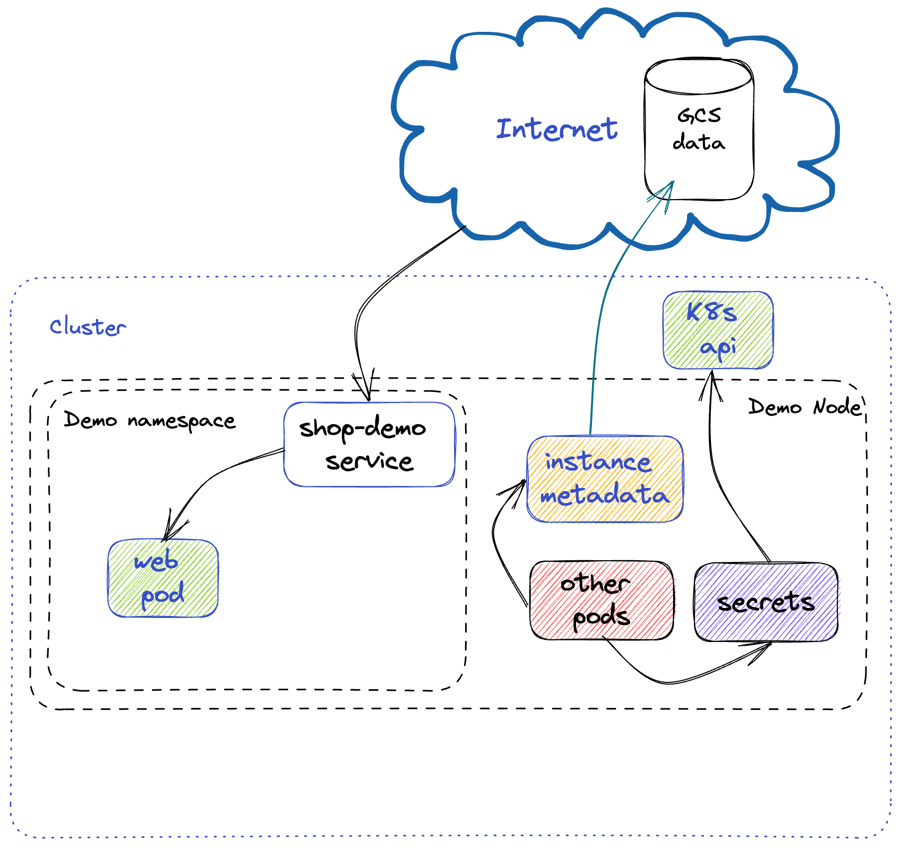

# KubeCon EU 2023 Talk - Demo Shop Service

Hello, hello! Welcome to Kuberwear Emporium, where your T-shirt dreams come true! ☸️

This is the repo that houses the kubernetes config as well as the different app versions demoed at KubeConEU 2023 at the talk [Prevent Embarrassing Cluster Takeovers with This One Simple Trick!](https://kccnceu2023.sched.com/event/97d14137853d8675a4e982515d983ad3), where we covered how misconfiguration can make services prone to all sorts of attacks.

If you want to play with the files and the vulnerabilities and also reproduce the steps in the demo, this might be a good starting point.

*Disclaimer*: This is by no means anywhere close to what actual production services look like! Take this as an illustration to prove a point and something to be used for educational purposes. Feel free to make suggestions on how to make this even more vulnerable, if you wish! 😈 Feedback is always appreciated! ❤️

*Warning*: Be careful when running this on your machine or in the cloud, as you could be exposed to attacks. For running in the cloud, we suggest using an IAP tunnel. You can tweak `start-iap-proxy.sh` with your own settings.

## architecture



## running the vulnerable app locally

Before running `shop-web` and `shop-web-pwned`, set up the environment for `imagemagick` by running the following commands for macOS:

- `pkg-config --cflags --libs MagickWand`
- `export CGO_CFLAGS="$(pkg-config --cflags MagickWand)"`
- `export CGO_LDFLAGS="$(pkg-config --libs MagickWand)"`
- Finally, run `go run main.go` and go to `localhost:8080` to see the page rendered

*Note*: For other operational systems, check out the instructions in [gographics/imagick](https://github.com/gographics/imagick)


## building your container images
We suggest creating an account on [DockerHub](https://hub.docker.com/), if you don't have one already. You can set up a registry there and then use your credentials in a Github Action that can be triggered on pushes and PRs against the repo.

There's a template that can be used in `ghactionexample/docker-build.yaml`

With that, you'll be able to use your image in your kubernetes manifests! Example:

```yaml
 spec:
      containers:
        - name: shop-web
          image: <YOUR-REGISTRY-REPO>/vuln-shop-demo-web:latest
          ports:
            - containerPort: 8080
          imagePullPolicy: Always
          livenessProbe:
```

## setting up your cluster and an attacker VM
You can choose any cloud provider of your preference or use [Kind](https://kind.sigs.k8s.io/docs/user/quick-start/) to spin up a cluster.

You can create a VM instance with [VirtualBox](https://www.virtualbox.org/) or in the cloud. This will work as the attacker VM that will launch the reverse shell.

## deploying your k8s manifests
In your cluster, to deploy the vulnerable workloads, you just need to run `kubectl apply -f <path-to-your-file>` followed by the name of the file. Example:

`kubectl apply -f shop-web-hostnetwork.yaml`

Don't forget to change the container image path to your own registry repo, as described in [Building your container images](#building-your-container-images)

*Note*: If you don't have kubectl installed, please follow the steps [here](https://kubernetes.io/docs/tasks/tools/)
## launching the reverse shell

To launch the reverse shell, just log in to the attacker VM. Then, upload `reverse.sh` and you should be able to launch a shell on your end and poke around the vulnerable container and even escape it, depending on the configuration you use.

*Note*: Make sure to update the `ATTACKER_HOST` IP  in `reverse.sh` to match yours. Refer to `demo.txt` for more detailed steps
## kubeaudit autofix - the defender

To install kubeaudit with HomeBrew, you can run `brew install kubeaudit` or build it [from source](https://github.com/Shopify/kubeaudit)

After deploying a vulnerable workload, you can run `kubeaudit autofix -f <path-to-your-file>`. Example:

`kubeaudit autofix -f shop-web-hostnetwork.yaml`

This will allow you to patch vulnerabilities! If you pass `-o` to `kubeaudit`, it will store the patched config in a new file.
If you want to see a diff between the patched version and the vulnerable version, you can do the following, for example:

`kubeaudit autofix -f shop-web-hostnetwork.yaml -o  shop-web-hostnetwork-fixed.yaml`

`diff shop-web-hostnetwork.yaml shop-web-hostnetwork-fixed.yaml`


### resources mentioned in the talk

- [Shopify/kubeaudit](https://github.com/Shopify/kubeaudit)

- [Kubernetes Goat](https://madhuakula.com/kubernetes-goat/)

- [Redhat State of Kubernetes Security Report (2022)](https://www.redhat.com/en/resources/state-kubernetes-security-report)

- ["What you Need to Know About Azurescape": (Palo Alto Networks blog post)](https://www.paloaltonetworks.com/blog/2021/09/azurescape/)

- ["Breaking out of Docker via runC – Explaining CVE-2019-5736" (Unit 42)](https://unit42.paloaltonetworks.com/breaking-docker-via-runc-explaining-cve-2019-5736/)

- ["The Rise of Misconfiguration and Supply Chain Vulnerabilities"(Hackerone- Jobert Abma)](https://www.hackerone.com/vulnerability-management/rise-misconfiguration-and-supply-chain-vulnerabilities)

- ["The Truth About False Positives in Security" (The Hacker News)](https://thehackernews.com/2022/08/the-truth-about-false-positives-in-security.html)

- "Hacking Kubernetes: Threat-Driven Analysis and Defense" - Book by Andrew Martin and Michael Hausenblas

- "The Kubernetes Book" - Book by Nigel Poulton and Pushkar Joglekar

- "Kubernetes Security and Observability: A Holistic Approach to Securing Containers and Cloud Native Applications" - Book by Brendan Creane and Amit Gupta
